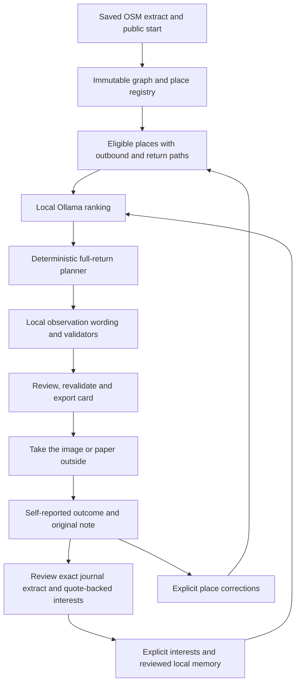

# Architecture, privacy and limitations

## The product loop

AI changes destination ordering and observation wording. It does not invent place IDs, choose an unvalidated path, determine public access or decide whether a person should go outdoors. The planner enumerates up to three stops (two for Seek), computes shortest eligible walking paths including return, and checks walking time, stop dwell, reserve, total distance and daylight. Rank utility leads selection; estimated duration and turns break ties. A permutation search over a capped pool of fifteen keeps this bounded.

## Modules and storage

| Boundary | Responsibility |
| --- | --- |
| `app.py`, `security.py`, `runtime_lock.py` | Local FastAPI lifecycle, session/host/origin policy and one server owner per data directory |
| `maps.py`, `places.py`, `areas_api.py` | XML acquisition/import, graph/snapshot provenance, entrances, corrections and custom pins |
| `planning.py`, `planning_api.py` | Eligibility, routes, budgets, daylight and deterministic ranking baselines |
| `ollama.py`, `quests.py`, `quests_api.py` | Local model inventory/inference, ID/reason/prose validation, retries, fallbacks and acceptance |
| `jobs.py`, `storage.py` | Single background worker, persistent status and atomic SQLite document updates |
| `outcomes.py`, `memory.py` | Self-reported visits, original-note revisions, exact extracts and individually reviewed interests |
| `cards.py`, `typography.py`, `static/` | Escaped phone/A4 card, measured text wrapping, local UI and vendored Leaflet |
| `air_quality.py`, `backups.py` | Explicit regional forecast policy and local backup/restore |
| `benchmark.py`, `evaluation.py`, `demo.py` | Separate model measurements, common-planner comparisons and artificial demo setup |

SQLite stores versioned documents for areas, immutable snapshots, settings, profiles, jobs, quests, outcomes, journals and interest/correction records. Raw XML and graph files sit under snapshot IDs; a SHA-256 fingerprint is verified when opening a graph. No hosted database, account, analytics or payment service is needed.

The snapshot's eligible mapped-place denominator is frozen at acquisition and shown with its date. Visits come from reached outcomes; custom pins are counted separately. Corrections can change present eligibility without rewriting a historical denominator. Reported destination visits never imply that surrounding streets were traversed.

## Generation and memory safeguards

The model must return the candidate IDs exactly once and choose each reason from its grounded catalogue. Rankings are validated independently of JSON shape. Observation wording is bounded, filtered for unsupported claims and measured against card layout limits. Seek also requires a feature ID from that stop's mapped or personally supplied evidence. Uncertainty and provenance remain visible. These filters can reject reasonable phrasing and cannot prove every accepted phrase is useful.

One corrective request is permitted per stage within a shared 120 s generation deadline. Ranking failure uses the deterministic interest baseline; wording failure uses templates. The interface and diagnostics label them separately, so a card can have AI ranking and template wording. Journal failure preserves the saved outcome and offers an exact extract with no inferred interests.

Journal drafts copy an exact, nonempty source-note excerpt. Interest proposals require an exact supporting quote and explicit positive preference language; neutral and negative mentions are held out by conservative English heuristics. These checks establish traceability, not interpretation accuracy. Only accepted proposals enter later context. User edits are intentional and may change an extract; pending and rejected suggestions do not silently become preferences.

Ranking receives bounded local context: explicit/accepted interests, reported visits and up to four recent original observations. Reflection input is capped at 2,400 characters, while the original note (up to 8,000) remains stored exactly. Cancelled jobs and jobs whose source changed cannot publish stale results. A forced interruption is surfaced on the next start.

## Network behaviour

| Action | Destination and data |
| --- | --- |
| Install dependencies / pull weights | Package and model providers during deliberate setup; these are separate installation tools |
| Download or refresh neighbourhood | Main Overpass API, then the independent Private.coffee Overpass instance; neighbourhood bounding box is sent |
| Core generation / reflection | Ollama at **127.0.0.1:11434**; selected candidate/context data stays on this machine when using local weights |
| Browser UI, map, card and history | The localhost Nukkad server; local files and saved graph, no external map tiles/fonts |
| Enable and refresh AQI | Open-Meteo air-quality endpoint receives the selected start coordinates, never notes/interests |
| Backup / restore / synthetic demo | Local files; no external service |

Downloads/refreshes are explicit. AQI defaults disabled and sends no request while disabled. Enabling it is not continuous polling: use its refresh control. Nukkad does not accept arbitrary remote model URLs and rejects cloud-backed models; also disable Ollama cloud features in its server configuration for an independent runtime safeguard. See [setup.md](setup.md).

With AQI enabled, cached retrieval age must be at most three hours and forecast-valid time within 90 minutes of now. Unknown, stale, invalid and above-threshold values block generation/acceptance. This is **U.S. AQI from CAMS global via Open-Meteo**, an approximately 45 km regional model estimate, not a sensor on your street. [Provider documentation](https://open-meteo.com/en/docs/air-quality-api) explains its scope. The user's threshold is a selected policy, not an app-issued medical recommendation.

## Local security boundary

The server binds to 127.0.0.1, accepts localhost hosts/same-origin browsers, requires a per-process token for mutations and applies a content security policy. User notes and map names use escaped SVG text/DOM text nodes. Routine web access logs are disabled. Personal data, cards, maps and diagnostic exports are ignored in the normal data/artifact locations.

This is a single-user local application, not authenticated multi-user hosting. Same-user processes and the Ollama runtime can access local data; backups are unencrypted. Some background libraries may emit their own errors. Inspect diagnostics before sharing; do not expose the server through a tunnel or open network bind and assume these local controls provide hosted security.

## Implemented capabilities and practical limits

Implemented: saved map acquisition/import and provenance; corrected/custom entrances; bounded full-return routes; local ranking with explicit fallback; grounded Seek/Wander prompts; numbered preview and phone/A4 export; self-reported progress/outcomes; reviewable journal/interest memory; optional regional AQI; backup/restore; comparisons and a reproducible synthetic demo.

Limits: no live GPS/navigation, automatic gate discovery, guaranteed public access, pace tracking, accessibility guarantee, weather policy, street-level air sensor, medical advice, fine-tuning, autonomous outdoor actions or cloud hosting. The map is only as current/complete as its saved source and corrections. A 50 m graph-node snap can omit sparse otherwise walkable segments. The current interests baseline/positive-language filter is English-oriented; Hindi or mixed-language notes need manual interest entry/review and separate evaluation.

Deterministic API tests and actual local-model synthetic evaluations have run. Process-level egress denial is narrower than disabling the whole machine's network. Actual phone readability, disconnected-machine checks, 2–3 neighbourhood outings and blinded human ratings remain to be recorded. See [evaluation.md](evaluation.md), [model-runtime.md](model-runtime.md) and [release-checklist.md](release-checklist.md). Open local operation removes dependence on a paid inference API; it does not make compute resources free or prove better recommendations.
