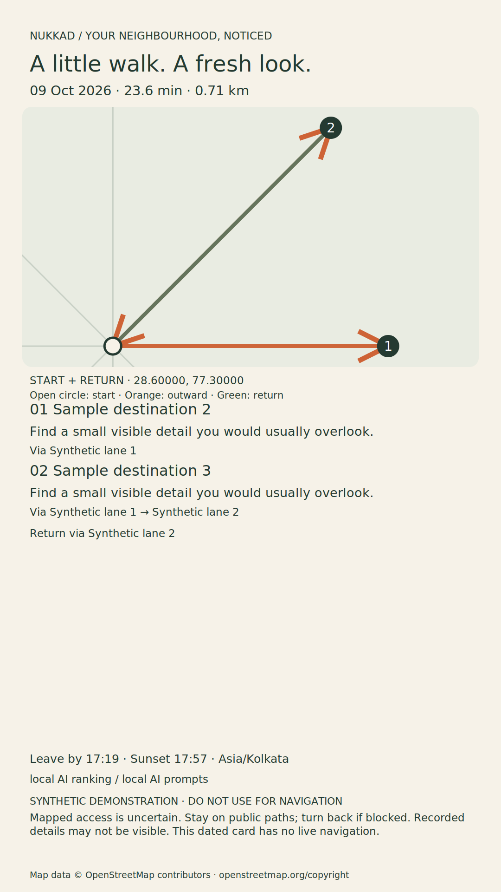

# Reproducible demonstration

## Make an isolated artificial area

Finish [installation](setup.md) and pull local weights, then run:

```sh
uv run nukkad demo --destination ./artifacts/demo
NUKKAD_DATA_DIR=./artifacts/demo uv run nukkad serve --port 8001
```

Open **http://localhost:8001**. The destination must not already exist; choose a new name for another run. The command never changes the configured personal data directory and makes no map/model download. Its area is labelled **Synthetic demo — not a real walk**. All coordinates, street branches, destination names and feature claims are artificial. Never navigate with it.

Eight places and two recorded feature examples are prepared; nature/art interests are explicit fixture inputs. No quest, outcome, note, visit or inferred interest is pre-seeded. Generation and reflection use the actual selected Ollama model if available; labels show any fallback. With daylight gating enabled, make the demonstration during daylight at the fixture's `Asia/Kolkata` location. If showing an after-dark software demo, explicitly disclose any policy change and do not take its card outside.

For another model, pass `--model EXACT_LOCAL_TAG` to both the demo command and the server, or change Settings. On a saved demo directory, Settings takes precedence after it has been saved. Do not silently reuse an old recording as a current inference run.

## Walk through the interface

1. Verify the synthetic area label and selected model readiness.
2. Enter 30 minutes, nature/art interests and Wander. Generate, retaining visible ranking/prose modes and actual generation seconds.
3. Review the numbered route, full return and card. Accept and download the image. Open it locally at full resolution; a laptop inspection is not actual phone testing.
4. Save **Not taken**, unresolved stops and a clearly fictional note, for example: `Synthetic demo only; no outing occurred. I enjoy architecture and would like to notice building shapes on a future walk.` Leave real outdoor timings empty.
5. Generate a reflection. Inspect the exact original note, journal mode and quote-backed proposal. Accept or reject them individually. Only accept interpretations the fictional example actually supports.
6. Generate another quest with explicit interests cleared. Inspect whether an accepted theme changes the ordering or chosen stops. A new ordering is possible, not guaranteed. Do not claim personalisation success from a reviewed proposal alone.
7. Reload, open Field notes and reopen the outcome. Edit the same record and check it remains one record. Try Seek with its recorded sculpture/sport examples, or correct a place and observe its later exclusion.

The test suite separately checks the reviewed-interest context and core loop with controlled responses. [Evaluation](evaluation.md) includes an actual local-model accepted-interest case and deliberately blinded comparisons. Neither is a human outing.

### Export example

This full-resolution example was exported from the installed wheel using **controlled test responses** and the artificial graph. Its independent synthetic label stays visible after transfer. It is a layout example, not real-model or field evidence.



## A 2–3 minute final recording script

| Time | Show | Evidence to retain |
| --- | --- | --- |
| 0:00–0:20 | The everyday barrier: wanting a small walk close to home; choose time/interests | Public chosen start only; hide personal notes |
| 0:20–0:50 | Start actual local inference and show the selected model | Keep measured duration and fallback labels; label any time cuts |
| 0:50–1:15 | Numbered route, return, daylight/access caveat and downloaded card | Real accepted card; inspect on the actual phone |
| 1:15–1:40 | Short footage using the card outside | User-recorded footage and reported outcome; no simulation presented as outdoors |
| 1:40–2:10 | Return note, reached/skipped stops and local map change | Destination reports only; do not imply surrounding streets were traversed |
| 2:10–2:40 | Review a source quote and generate a later quest | Show actual influence, or honestly report no change/fallback |
| 2:40–3:00 | Local/open ownership and limitations | Explain where weights, map and notes live; include repo link |

Until the actual outing footage exists, a software-only recording must remain labelled **synthetic walkthrough**. Browser viewport emulation is useful layout evidence but cannot replace opening the exported image on the real phone. A static replay must be labelled recorded and identify the model, date, revision and synthetic/field scope.

Recordings, PNGs and private diagnostics should stay under `artifacts/`. A public demo needs a reviewed upload/link; the application is deliberately localhost-only. No footage or DEV article is published by the demo command. Check [release-checklist.md](release-checklist.md) before submission.
